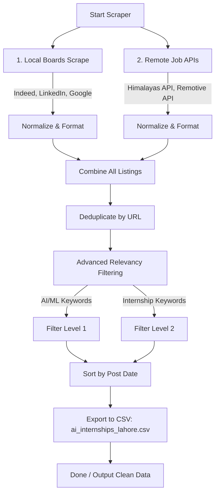

# 🤖 Pakistan & Remote AI/ML Job Scraper v2.0 (Multi-API)

[](https://www.python.org/)
[](https://opensource.org/licenses/MIT)
[](https://github.com/cullenwatson/JobSpy)
[]()

A professional-grade, multi-source job scraping and aggregation pipeline designed to surface high-quality **AI/ML Internships and Entry-Level Roles** locally in Lahore, Pakistan, and remotely worldwide.

---

## 📊 Pipeline Architecture

This scraper integrates both standard browser scraping engines and modern public job board APIs to collect, normalize, filter, and export the freshest internship listings:



---

## ✨ Features

- **Multi-Source Aggregation**: Extracts listings concurrently from 5 premium job boards and APIs:
  - **Indeed & LinkedIn**: Using robust scraper instances configured with custom parameters.
  - **Google Jobs**: Using advanced syntax-driven search strings.
  - **Himalayas API**: Querying a highly reliable remote public developer job endpoint.
  - **Remotive API**: Retrieving global remote opportunities directly from the Remotive developer job board.
- **Smart Filtering Engine**: Eliminates unrelated roles by strictly validating both **AI/ML keywords** (`AI`, `ML`, `Machine Learning`, `Data Science`, `Deep Learning`, `NLP`, `Computer Vision`) and **Internship keywords** (`intern`, `internship`, `trainee`, `fresh`, `student`, `co-op`).
- **Geo-Targeted Local Search**: Pre-configured to extract high-density tech hubs, specifically targeting **Lahore, Pakistan** for local hybrid/on-site postings.
- **Automated Deduplication & Cleaning**: Automatically handles duplicate URLs across multiple job boards, standardizes schemas, and sorts results with the newest jobs first.
- **Instant Structured Export**: Compiles all clean listings into a well-formatted CSV (`ai_internships_lahore.csv`) with full quotation safety for seamless parsing.

---

## 🔧 Prerequisites

Before running the scraper, ensure you have the following installed by running these commands in your terminal:

1. **Python 3.10+**
   - Check if installed:
     ```bash
     python --version
     ```
   - If not installed, download from [python.org](https://www.python.org/).

2. **Required Libraries**
   - Install via pip:
     ```bash
     pip install pandas requests beautifulsoup4 tls-client markdownify pydantic numpy
     ```
   - *(Optional)* If you are using Poetry for dependency management, you can install everything in one command:
     ```bash
     poetry install
     ```

---

## How to Run

1. **Clone the repository:**
   ```bash
   git clone https://github.com/M-Talha-Farooqi/Amazon_Automation.git
   cd Amazon_Automation
   ```
   *(Note: Adjust the repository URL to match your new repository's URL)*

2. **Run the job scraper:**
   ```bash
   python search_jobs.py
   ```
   This will run the multi-source scraper, apply robust keyword filtering, deduplicate listings, and export your fresh listings directly to `ai_internships_lahore.csv`.

---

## ⚙️ Customizing Search Parameters & Location

You can easily adapt this scraper to search for any technology, role, or location by modifying a few variables directly inside [search_jobs.py](file:///c:/Users/SNAKE/Desktop/Job%20Scrapper/JobSpy-main/search_jobs.py):

### 1. Target Tech & Location (Indeed, LinkedIn, Google Jobs)
Locate lines `89-90` inside the `main()` function:
```python
local_search_term = '("AI" OR "ML" OR "Machine Learning" OR "Artificial Intelligence") intern'
location = "Lahore"
```
* **To change the role**: Modify the `local_search_term` query string (e.g., `'("Frontend" OR "React" OR "Web Developer") intern'`).
* **To change the city**: Change the value of `location` (e.g., `"Karachi"`, `"Islamabad"`, or `"Remote"`).

### 2. Remote API Queries (Himalayas & Remotive)
Locate lines `128-131` inside the `main()` function:
```python
api_jobs += fetch_himalayas_jobs("AI intern")
api_jobs += fetch_himalayas_jobs("machine learning intern")
api_jobs += fetch_remotive_jobs("AI intern")
api_jobs += fetch_remotive_jobs("machine learning intern")
```
* Change the strings inside the `fetch_*` functions to query other roles or technologies (e.g., `"react"`, `"python"`, or `"flutter"`).

### 3. Relevancy Filters (AI/ML & Internship Check)
To ensure only highly relevant jobs make it into the final list, the scraper performs strict keyword validation. Locate lines `150-151`:
```python
ai_keywords = ['ai', 'ml', 'machine learning', 'artificial intelligence', 'data science', 'deep learning', 'nlp', 'computer vision']
intern_keywords = ['intern', 'internship', 'trainee', 'fresh', 'student', 'co-op']
```
* **`ai_keywords`**: Update this list with keywords related to your target field or tech stack.
* **`intern_keywords`**: Update this list with keywords related to the desired experience level (e.g., add `'junior'` or `'entry'` or remove them if looking for full-time mid/senior roles).

### 4. Output Filename
To change where the clean data is saved, modify line `174`:
```python
output_file = "ai_internships_lahore.csv"
```

---

## 👨‍💻 Authors

**M. Talha Farooqi**
- *Final Year BS Software Engineering Student*
- *University of Management and Technology, Lahore*

**Husnain Aslam**
- *Final Year BS Software Engineering Student*
- *University of Management and Technology, Lahore*

---

## 📄 License

This project is licensed under the MIT License.
